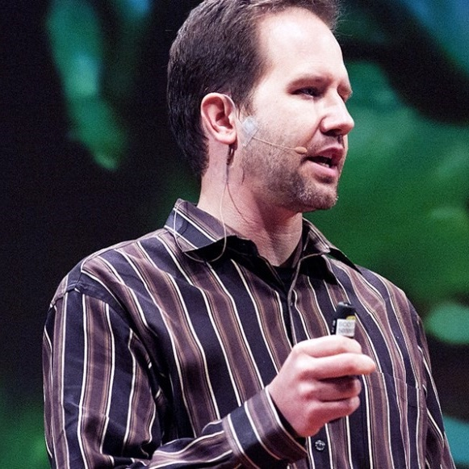
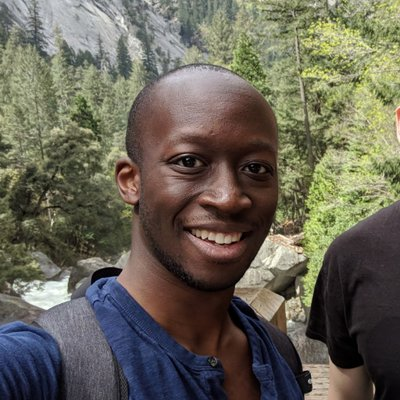

## Behind The Mic

## Doctor McKayla

Show Host

Michaela Greiler has a passion for understanding how people develop software. For years, she has been analyzing and improving the software development processes at Microsoft. Now she runs her own training and consultancy business, where she helps engineering teams around the world to [make code reviews their superpower](https://www.michaelagreiler.com/workshops).

She shares her findings through [articles on her blog](https://www.michaelagreiler.com/) or in [scientific journals](https://www.michaelagreiler.com/publications/), in publications such as [freecodecamp](https://www.freecodecamp.org/news/author/michaela-greiler/) and[ at conferences](https://www.michaelagreiler.com/speaking/). And, she also runs a [weekly software engineering newsletter](https://www.michaelagreiler.com/code-review-e-book/) that more than 1400 people enjoy.

With this podcast, she wants to open doors of successful software companies, and discuss with her guests what it takes to develop scalable, maintainable and reliable software people love.

[  
 Facebook-f ](https://www.facebook.com/seunlocked/)  
[  
 Twitter ](https://twitter.com/mgreiler)  
[  
 Wordpress ](https://www.michaelagreiler.com)  
[  
 Youtube ](https://www.youtube.com/channel/UCWVxDd-f0EbQ_t56MyLobqw?sub_confirmation=1)

## Subscribe To Our Podcast

### Never miss an episode!

Subscribe on  
[iTunes](https://podcasts.apple.com/at/podcast/software-engineering-unlocked/id1477527378?l=en), [Google](https://www.google.com/podcasts?feed=aHR0cHM6Ly9mZWVkcy5zaW1wbGVjYXN0LmNvbS9LMV9tdjBDSg%3D%3D), [Deezer](https://www.deezer.com/show/465682), or via [RSS](https://www.software-engineering-unlocked.com/subscribe/)

  
  
  
  

## The Guests

## Each week a new guest​

Show Guest

Each week, I invite a new thought leaders, or experienced developers to talk with me about their personal journey, their experiences and their software engineering practices and company culture.

Right now, more than a dozen developers from around the world joined me. You can find a few of the guests listed below. [To see all episodes, click here.](https://www.se-unlocked.com)

## Cassidy Williams

Show Guest

Cassidy is a Senior Software Engineer at CodePen, one of the largest communities for designers and developers. CodePen has hundred of thousands of users, but the team is only 8 people strong. I talk with her what this means in term of responsibilities and ownership of the site.

Find this awesome [first episode here](https://www.software-engineering-unlocked.com/episode-1-cassidy-williams/)!

[  
 Twitter ](https://twitter.com/cassidoo)  
[  
 Wordpress ](https://cassidoo.co/)  
  

## Scott Hanselman

Show Guest

Scott is a web developer who has been blogging for over a decade. He works in Open Source on ASP.NET and the Azure Cloud for Microsoft out of his home office in Portland, Oregon. With his awesome podcast Hanselminutes, and through other activities, Scott actively works on making tech a more welcoming place.

Listen to this [great episode here!](https://www.software-engineering-unlocked.com/episode-2-scott-hanselman/)

[  
 Twitter ](https://twitter.com/shanselman)  
[  
 Wordpress ](https://www.hanselman.com/)

## Leif Singer

Show Guest

Leif is a software engineer at Automattic – the company behind WordPress. Leif shows us what it is like to work at a fully remote software engineering company, when and how he connects with his colleagues, and what it takes to be hired at Automattic.

Listing to this episode full with advice on [how to get a remote job at Automattic episode here.](https://www.software-engineering-unlocked.com/episode-4-leif-singer/)

[  
 Twitter ](https://twitter.com/lsinger)  
[  
 Instagram ](https://www.instagram.com/a1000dreams/)  
  

## Suz Hinton

Show Guest

Suz is a engineer at Stripe – one of the most popular payment providers in the world. Suz talks with me about why she left her previous job at Microsoft, and how she made sure to find a better fitting and supportive work environment at her next gig.

Find this [inspiring episode here](https://www.software-engineering-unlocked.com/episode-10-no-corporate-games/)!

[  
 Twitter ](https://twitter.com/Sandeepg33k)  
[  
 Instagram ](https://www.instagram.com/hashnode/)

## Courtland Allen

Show Guest

Courtland is the founder and chief-indie hacker of the vivid and booming online community Indie Hackers. In this episode, he talks with me how he managed to start a profitable business within six weeks through his four-phase plan.

Find [this entrepreneurial episode here](https://www.software-engineering-unlocked.com/episode-12-profitable-business-courtland-allen/).

[  
 Twitter ](https://twitter.com/alperkemalkoc)  

## [find all episodes here…](https://www.se-unlocked.com)

## About Our Show

This show was born out of Michaela’s curiosity for how different companies develop software. How does their tech stack look like? Which practices do they follow? Do they do code reviews? Are the concerned about technical debt? And what about their culture and company values?

With this podcast Michaela wants to open doors at different companies, and get the perspective of experts in the fields about how to develop maintainable, reliable and scaleable software people love.

Michaela’s guests come from completely different backgrounds. Some come from large cooperation such as Microsoft, Google or Facebook. Some are founders of their own tech startup. And some come from more traditional or smaller businesses.

What they all have in common is a passion for high-quality software.

But how do they achieve their goal? As we all know, there isn’t only one way of developing quality-software. So, what best practices do they value, which management style do they prefer, and do they follow a certain software methodology. What problems do they struggle with? And which ones did they overcome already?

Let’s find out together in the Software Engineering Unlocked Podcast!

## Join Thousands of Listeners Worldwide

Yes, even though **this show is brand-new**, each month already thousands of listeners are tuning in.

Thank you for being one of them! 

## Join Our Newsletter

Want to connect on a deeper level? Make sure to hop on the mailing list and get behind the scenes information the show, the guests and the host.

 <link href="//cdn-images.mailchimp.com/embedcode/classic-10_7.css" rel="stylesheet" type="text/css"></link>

<form action="https://se-unlocked.us3.list-manage.com/subscribe/post?u=74b1790e5710618801de6d4a7&id=a1f53b7c4f" id="mc-embedded-subscribe-form" method="post" name="mc-embedded-subscribe-form" novalidate="" target="_blank">\* indicates required  
<label for="mce-EMAIL" style="visibility: hidden;">Email Address \*  
</label>  
<input id="mce-EMAIL" name="EMAIL" type="email" value="E-mail"></input>  
<label for="mce-FNAME" style="visibility: hidden;">First Name </label>  
<input id="mce-FNAME" name="FNAME" type="text" value="First Name"></input>  
  
<input name="b_74b1790e5710618801de6d4a7_a1f53b7c4f" tabindex="-1" type="text" value=""></input>  
<input id="mc-embedded-subscribe" name="subscribe" style="background-color: #20bb60;" type="submit" value="Subscribe"></input>  
</form>
