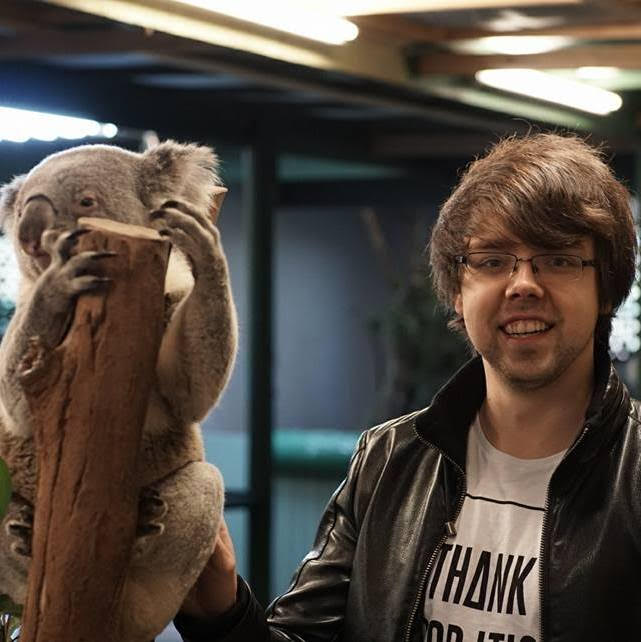

In this episode, I talk to Tomasz Łakomy, a senior frontend engineer at OLX Group.
   We also talk about:
<ul>
<li> how they develop, test, and reviews software at OLX group,</li>
<li> what war rooms are and how they help to combat technical debt,</li>
<li> how he managed to create over 170 video tutorials about software engineering,</li>
<li> why he is AWS certified as a front-end engineer, and</li>
<li> how skydiving helped him to be a better software developer.</li>

</ul>

<b>Episode Resources:</b> 
<a href="https://codesubmit.io/">CodeSubmit</a> 
<a href="https://www.michaelagreiler.com/workshops">awesomecodereview.com</a> 
<a href="https://twitter.com/tlakomy">Tomasz’s Twitter</a> 
<a href="https://tlakomy.com/seven-years-as-a-developer-lessons-learned">7 years as a developer – lessons learned</a> 
<a href="https://tlakomy.com/">Tomasz’s Tech Blog</a> 
<a href="https://www.olxgroup.com/">OLX Group</a> 

<b>About Tomasz Łakomy</b> 
Tomasz Łakomy, a senior frontend engineer at OLX Group. Tomasz is fascinated about teaching everything he knows and has over 170 video tutorials.

 Today’s episode is sponsored by <a href="https://codesubmit.io/" target="_blank" rel="noreferrer" >CodeSubmit</a> – the best take-home assignments for your tech hiring! 

## Read the whole episode "Combatting tech debt in war rooms" (Transcript)

_\[If you want, you can help make the transcript better, and improve the podcast’s accessibility via_ [Github](https://github.com/mgreiler/se-unlocked/tree/master/Transcripts)_[.](https://github.com/mgreiler/se-unlocked/tree/master/Transcripts) I’m happy to lend a hand to help you get started with pull requests, and open source work.\]_
