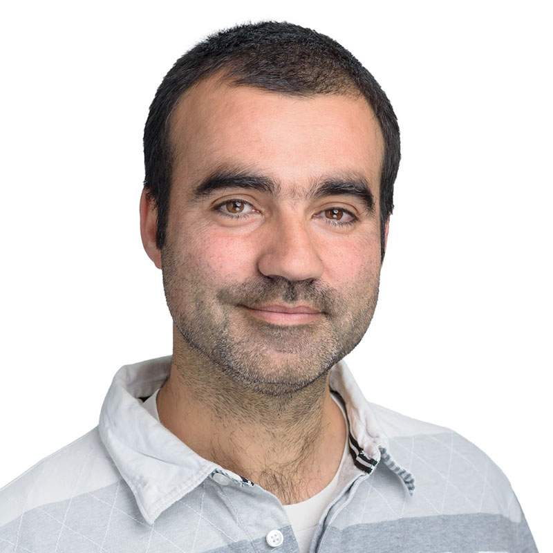

Yehonathan Sharvit explains the why data-oriented programming is better than object-oriented programming.
   

<iframe class="video" src="https://www.youtube-nocookie.com/embed/xJTBHkAImb0" title="YouTube video player" rel=0"  frameborder="0" allowfullscreen="allowfullscreen allow="accelerometer; autoplay; clipboard-write; encrypted-media; gyroscope; picture-in-picture" allowfullscreen></iframe>

 
We also talk about:
<ul>
<li> the basics of Data-Oriented Programming,</li>
<li> how Data-Oriented Programming compares to object-oriented programming and functional programming,</li>
<li> and how we can apply it in our codebases</li>
</ul>

<b>Episode Resources:</b> 
<a href="https://www.manning.com/books/data-oriented-programming?utm_source=podcast&utm_medium=organic&utm_campaign=book_sharvit2_data_1_29_21&utm_content=seunlocked">Book: “Data-oriented programming”</a> 25% off for se-unlocked listerners  
Yehonathan’s <a href="https://blog.klipse.tech/">tech blog</a> 
Yehonathan’s twitter <a href="https://twitter.com/viebel">handle</a> 
My <a href="https://www.manning.com/books/data-oriented-programming?utm_source=viebel&utm_medium=affiliate&utm_campaign=book_sharvit2_data_1_29_21&a_aid=viebel&a_bid=d5b546b7">book</a> 

<b>About Yehonathan Sharvit</b> 
Yehonathan Sharvit, is author of the book Data-oriented programming. Yehonathan is a developer, author, and speaker. He has tons of experience in full-stack development using various languages such as Java, Javascript, and Ruby. But his favorite language is Clojure. He bundled all this experience and knowledge into his book which should be finished this summer.

This episode is sponsored by <a href="https://www.tonic.ai/?ref=se-unlocked">Tonic.ai</a> – where your data is modeled from your production data to help you tell an identical story in your testing environments.

 
 

  <h2>Other episodes you'll enjoy</h2>
    

      

          

            <h3 class="mb-0"><a href="https://www.software-engineering-unlocked.com/legacy-code-michael-feathers/">How to work with legacy code with Michael Feathers</a></h3>
  <audio controls preload="none">
                <source src="https://cdn.simplecast.com/audio/aaca909a-e34f-49ae-a86f-f59e4fa807f0/episodes/c51d6cda-2f16-4872-bfa5-20472d0ed1d6/audio/5700cc3c-c308-46ed-bd29-3225db1dfd6f/default_tc.mp3" />
              </audio>
          

        

      

    

      

          

            <h3 class="mb-0"><a href="https://www.software-engineering-unlocked.com/tests-find-bugs/">How to write tests that find bugs</a></h3>
  <audio controls preload="none">
                <source src="https://cdn.simplecast.com/audio/aaca909a-e34f-49ae-a86f-f59e4fa807f0/episodes/53528752-3178-4d13-9b17-8285eeab471c/audio/f768b14a-56e4-4d9a-8ed2-d27b3b1342f5/default_tc.mp3" />
              </audio>
          

        

      

    

      

          

            <h3 class="mb-0"><a href="https://www.software-engineering-unlocked.com/high-quality-code/">The Secret To High-Quality Code</a></h3>
  <audio controls preload="none">
                <source src="https://cdn.simplecast.com/audio/aaca909a-e34f-49ae-a86f-f59e4fa807f0/episodes/47f883a9-4633-4c1b-9e5f-c673f3b0b280/audio/5497ed3e-ecfd-4df1-ac15-28738a2a08fd/default_tc.mp3" />
              </audio>
          

        

      
 

 

## Read the whole episode "what the heck is data-oriented programming?" (Transcript)

_\[Make the transcript better, and improve the podcast’s accessibility via_ [Github](https://github.com/mgreiler/se-unlocked/tree/master/Transcripts)_[.](https://github.com/mgreiler/se-unlocked/tree/master/Transcripts).\]_
