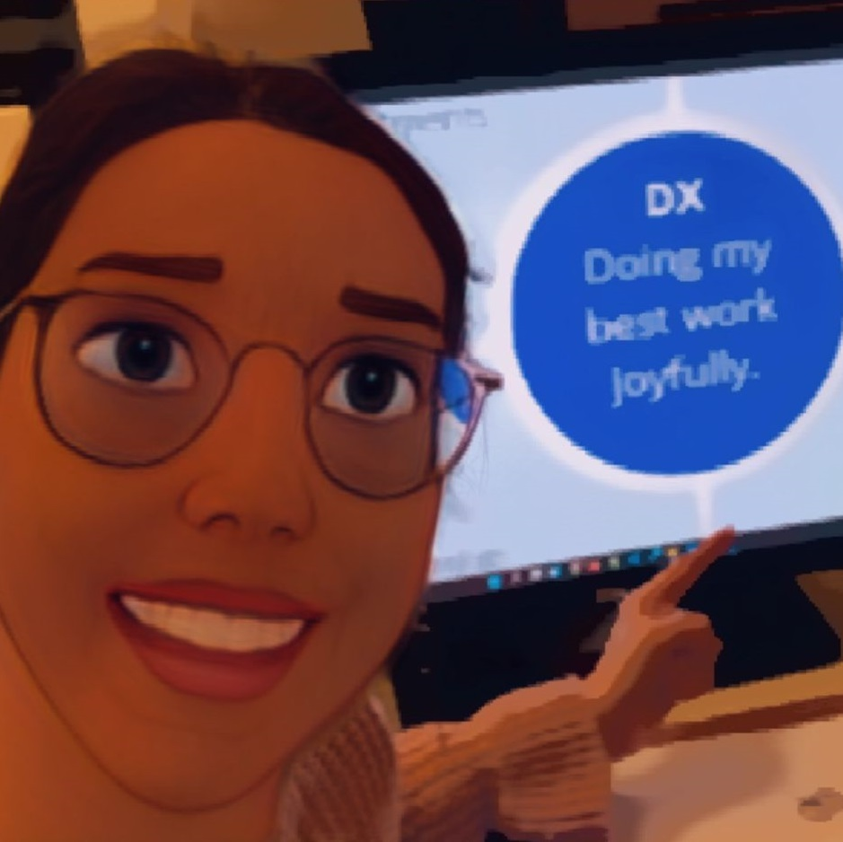

In this special episode (50th) I’ll tell you a bit about the research on developer experience and developer productivity that kept me so busy this year.

You will learn about:

- some history of productivity focused thinking
- new productivity research like the Space Framework that helps understand and measure developer productivity
- the difference to the Developer Experience framework that I co-created
- why (IMHO) metrics and a productivity-driven mindset can be problematic for your culture and long-term success
- and what you should focus on instead.

 

Book your [awesomecodereview.com](https://www.michaelagreiler.com/workshops) workshop!

Links:

- [Space Framework](https://queue.acm.org/detail.cfm?id=3454124)
- Book: [Rethinking Productivity in Software Engineering](https://link.springer.com/book/10.1007/978-1-4842-4221-6) (open access, so you can read for free 😉 )
- Short essay: [“Why we should not measure productivity”](https://link.springer.com/chapter/10.1007/978-1-4842-4221-6_3) by Amy Ko
- [Developer Experience Framework](https://www.michaelagreiler.com/wp-content/uploads/2021/12/Framework-for-Understanding-and-Improving.pdf)
- How did you like the episode? [Please tell me here: https://forms.gle/m4cYfK4y1VNWPgUm7](https://forms.gle/m4cYfK4y1VNWPgUm7)

### Subscribe on [iTunes](https://podcasts.apple.com/at/podcast/software-engineering-unlocked/id1477527378?l=en), [Spotify](https://open.spotify.com/show/2wz1OneBIDXpbBYeuyIsJL?si=2I0R0HuaTLK6RT0f7lDIFg), [Google](https://www.google.com/podcasts?feed=aHR0cHM6Ly9mZWVkcy5zaW1wbGVjYXN0LmNvbS9LMV9tdjBDSg%3D%3D), [Deezer](https://www.deezer.com/show/465682), or via [RSS](https://www.software-engineering-unlocked.com/subscribe/).

Transcript: Do not measure developer productivity
-------------------------------------------------

\[00:00:00\] Michaela: Hello, and welcome to the software engineering podcast. I’m your host, Dr. McKayla, and today is a special episode. Today is the 50th episode. Can you imagine? Time flies! And as I announced last time, this one has a new format. It’s not an interview. No, no, no. There’s only me talking. There’s no other person joining me. Well, I want to tell you a little bit about the research that has kept me so busy over this year. I spent really hundreds of hours investigating what makes developers happy, productive, and satisfied with their work. I was especially looking at the concept of developer experience and what that is, well, that’s, that’s the content of this episode today.

What inspired me to talk about this is that I recently gave a keynote at a large internal conference at a large corporation to over 1,300 developers. And when I was preparing this talk, I thought, well, this could be actually an interesting topic also for the podcast. And yeah. It’s something that I know a lot about that I spent many years actually researching being in this area. And so, yeah, I wanted to tell you a little bit more about developer experience and code reviews, obviously, and productivity. And today’s episode is really about productivity and developer experience and you know, what those two concepts have in common and what makes them different. And so, yeah, well, let’s, let’s try it out. Cut me some slack, please, because as you know, I’m experiencing experimenting with the new format and I would also love your feedback. So I will link at the end. I will link a survey. You can always go to the survey and let me know what you think about it. Let’s start. And do you know why we start? We started in 1440

\[00:02:00\] that’s right. 1440. We are not stopping in 1940. He started in 14, 14. 1440. There was a very unsuccessful businessman that wanted to reveal a new and really astonishing invention. And he was hoping it’d with this new invention, you will be able to pay off all his death. In fact, he did not manage to do that, but what he revealed was really, really unique and very game changing. It changed a lot. Do you know what mean. It was the printing press and the, the guide revealed that boss called Johannes Gutenberg. And the printing press was a machinery that the loud to print books and other documents extremely efficiently. And what this means is that now books and documents could be manufactured in mass and it could also reach masses. So it was not only one book that was super expensive because it was hand printed or handwritten, but they could now print really a lot of books and became much cheaper. So everybody could actually buy one. And this invention lad to many, many. Changes, right? It led to widespread literacy and education, especially of the middle-class. And also change of thinking came with that suddenly a new thoughts, you know, became, could spread around very easily. And so this invention also played a key role in development like the Renaissance or reformation or age of enlightenment and the scientific revolution. And so it permanently altered the structure of society through mass communication. And this is why this printing revolution was so, so important. But also with this printing revolution and new thought was really made to work and that is productivity. So in comparison, if you had this printing press, you could produce up to

\[00:04:00\] 3,600 pages. But before the ad, you could only print 40 by hint printing or only a few by hand writing head copying. Right. So we really saw that suddenly we can produce much more efficiently. But this was obviously only the tip of the iceberg, right? There was the industrialization which came later starting mid 18th century and more and more production processes became driven by technology and by machine. And also the machines, like the printing press that was first hand operated now became operated by steam engines and electricity. And this led to another level of mass production and the thought of productivity became even more engraved in our minds. Right. But it also meant that a lot of professions became obsolete. Right. So we, we didn’t do. Everything from start to finish, like producing a shoe. There wasn’t like a Shoemaker that would know how to do that completely. But new and new professionals born at that was the factory worker. And because we were so focused on making the production process more effective and efficient, we realized that actually, if you do fewer staff, And, you know very, very focused task that this would lead to better results, more quality, but also really a higher production scale. And well this means that only even nowadays, right, a lot of those factory workers only have to do a few hand movements or tasks, so. With this, we could really reach a productivity level that we haven’t seen before, but you also noted that industrialization. Wasn’t where we stopped. Right? Mid of the 20th century, the digital revolution took place. And this is really important for us, right? Because now automation happened and that was enabled by computer.

\[00:06:00\] And once again, it’s replaced a lot of professions, but also it aided a lot of professions. Right. And so when computers took over work, that before hand was only done by humans, right. They could do it faster and with less errors than human. This technology was more, much more versatile than a technology before, right? It’s not one machinery that can do one task, but it’s a machinery that can do so many tasks in theory, perform endless operations. And so it’s very important to ask about, well, what, what can this technology enabling even at a Loveless already ask herself? Well, Can Kim computers even think, and she concluded a machinery is only as intelligent as we instructed. And while AI promises to shift us, we are not there yet. So we have to, we have to instruct machines. We have to instruct the computer to do it. And so this is all professional software engineers, developers, right? But there is also product managers are HITECH testers, UX designers, and many, many more, many more that really are needed to work with this versatile new technology and make it do what we wanted to. The problem is that productivity is still on the forefront of our minds. And it’s a goal that we have, right. But we face this dilemma that now these professions it’s not about doing so much as it’s about thinking, right? So the fuel of the productivity is our thinking, not so much our doing and now assessing and grasping what productivity even means becomes extremely difficult. Yeah, we try, we try we all know that, you know, if we want to measure productivity, we can do it by lines of code. We can also not, you know, measure our productivity by the number of meetings

\[00:08:00\] we attend. And the company, unfortunately, does not automatically gets more successful as we, you know, ride more. It doesn’t get more profitable with that. It’s not a guaranteed the recipe, but still we try, we try and we try and we also try to measure productivity because somehow we want to be accountable and we must be accountable organizations. I want us to be accountable. Our, our team wants us to be accountable. Right. And so we have to demonstrate our contribution and this thought of productivity. That’s very, very connected to activity and output is, is, is on the forefront of our minds. And so, yeah, we’re measuring, unfortunately, some companies, some teams are measuring lines of code or features now, although those kind of things, because we can easily access it. And I think there’s this heritage that we have from how we did it before. But it’s not as accurate anymore as it was before. and so yeah, I want to talk about that a little bit about productivity and how can we assess it and an interesting, very new. Approach to assessing this productivity problem comes from Nicole four screen from GitHub and Margaret and story from university of Victoria. And then there are a lot of Microsoft research faults like Chandra Mudela and Brian hook and Jenna Butler. But what did they do? Well, they created something called the space framework and the whole idea behind it is let’s look at productivity and let’s try to measure it. Right. And I think that the biggest takeaway from their work that they did is that. Well, we cannot measure productivity with one metric to one, you know, with one single dimension. And, and I think that’s very true and there’s also a really, really excellent book. I will link everything in the show note, which is called. I have it here next to me. It’s called

\[00:10:00\] rethinking productivity in software engineering. It’s not that new anymore. I think it’s 2019 or something. And it’s the, the editor where Tom Zimmerman as well, right. Also from involved in the space framework and Caitlin Spassky and there a lot of different researchers around the world actually write some essays. That are based on their research that they do about what does productivity mean? And here we have also to other people talk about well, there’s not a single metric, right? This is something that actually comes also from Kathleen’s Bardowski and, her colleagues at Google, right? Where you say, well, let’s actually not one similar metrics. You cannot compromise that. And if you look through the book, you will see that productivity can have so many different dimensions and people look at so many different things. What does productivity even mean? And but coming back to the space framework, I want to talk a little bit about this. And so this ad, well, there’s not one dimension that we can, you know, somehow. Measure productivity, right? So like lines of code, but there are different dimensions that you have to look at. And they, I think they are really interesting because it’s the first dimension it has to do. You have to measure something around satisfaction and wellbeing, right? So this is helpful filled our developers with their work, with the team. Oh, happy and healthy. Then you have to measure something about performance. And this is more in terms of outcome than output, right? Output would be well, the, the features, right? The number of features, for example, that we do, but outcome would be more, oh, how happy our customer. What’s the quality of our, softhearted VO developing. And does it make revenue, right? Something along this lines. And then you talk about activity, right? Activities very often, you know, in the center of our minds, when we have probably think about productivity and it would be for example, commits how many commits are happening or, you know, what are you

\[00:12:00\] doing? That very easily maybe can be measured through our systems that we have. Uh, Another dimension is communication on collaboration, right? How people in teams communicate and work with each other. And again, the idea is, again, how can we actually measure that? How can we put it into a metric? And the final thing is efficiency and flow, right? So do developers have minimal interruptions or delays for them? And if you look at the space framework, I’m going to link that as well. Then they have some example metrics, right? Because it’s all about metrics. And they give some examples, right? Like for satisfaction, you could have a developer satisfaction survey. So you know, a little bit about how people feel about it, about their work for performance. Well, he could have cultural view blossom for activity. You could have the number of code reviews completed, right? This is really just a activity metrics and then communication and collaboration would be well. You know, PR merge time is something that they came up with, right. And efficiency and flow would be the code from your timing. And while I think it’s really one of the. One of the most holistic views on productivity that I have seen so far. And I think it gives a good balance between those things. I still have the feeling that we are trying, you know, to measure things that are very often meaningless, right? Like for example you know, PR merged times. It has a meaning, but most of the time, I would say the meaning comes from really looking closely and qualitatively at each of those PR merge types. Right. So you can, if you, if you put up a dashboard. What will they say, right. What, what will happen to all of that? And then also, how can you combine those different metrics that you’re not having and get this, this holistic view of productivity? I think it’s very, very difficult

\[00:14:00\] understanding. And there’s also a nice essay, very short essay. So if you want to read it I will link it from Amy Cole as she’s a professor at the university of Washington. And she says why we should not measure for active. And she wants us to be really cautious because it can send the wrong incentives. Right. So when you’re measuring, if you start measuring, for example, cultural view, velocity, what will happen if people know it? Right. And if you didn’t know that this is actually something that you that you judge and is, is the changes in behavior. Is that really what you want? Do you want them to finish that pastor? But you know, are you lacking somewhere else? I think it’s a little bit tricky. And so I find the space framework extremely inspiring, but for my research, we took a little bit different stand on the whole, on the whole part. And it goes away from measuring productivity to more, to measuring developer experience because there’s a lot of research that shows. Productivity and satisfaction somehow hadn’t had, right. They somehow influence each other. They are entangled. The people that are more motivated, they are also performing better. It’s a lot of research around this. And so developer experience was something that we thought well, instead of, you know, looking at those metrics and really about productivity, let’s think about how do be puffy. Uh, About the work, how do they think about their work and how to do value, but right. Which is our definition of develop experience. So what are the encountered in their day-to-day work and how does this make them feel? And so we also looked at different dimensions that are. Influencing how a developer feels about their work. And I’m going to, to show you a couple are, tell you a couple of those dimensions, right? So we also thought about collaboration and culture. You can see there is a parallel to the space framework. We thought about developer flow and fulfillment. I

\[00:16:00\] would say to somehow goes into this efficiency and flow area. We thought about product management, which is not really there. Right. So it’s different. And development and release, which is really the tooling. And I think this is also very different. And so if you assume in a little bit to this developer experience framework, and I will link that as well. But I think that the basic concept is quite different than. We don’t want to have any metrics around that, but we really want deeply to understand what impacts, how good a person can do their work. A developer can do the work, right. And I define it as well. Developer experience is all about doing. Your best work joyfully. Right? So that you can do your best work and it it’s, it’s fun. And so I did really a lot of interviews with people and I think this fun aspect or that I’m proud of my work. I think this came up a lot. And, and so we want the, to understand what’s, what’s impacting people and we started culture collaborative ness, right? So supportiveness how connected to a field with my team? How, how safe do I feel? My work environment, all these are really, really important. There’s a lot about product management. Is that actually going very well? Right? Do we have clear goals, requirements? Can we work iteratively, right? Do we have reasonable deadlines? I mean, do you know how, how unreasonable deadlines, how do destroy moral. It’s crushing it’s soul crushing. I heard stories and, and with the soul crushing activities that we have, we definitely reduce our productivity. We reduce our performance, right? So we want good experiences for our developers. And so this developer, extreme Springbrook book is really all about. Understanding what makes for a good day, what makes for good work for joyful book that people can nicely work. And I think Dan, it’s all about how do we assess that? Right. So and it’s not metrics, we don’t, we don’t crawl data from guitar or get lab and then,

\[00:18:00\] you know, merge it and then it comes out the number. It’s really about understanding. I think this is so important. So this is really where I’m coming from. I always think it’s about understanding what’s really happening. So let’s say one of the things in the bucket of development and release would be the code based help. So really understanding how is our code base health, but not, you know, one metric that tells us, oh, we score a 71% out of a hundred. No, it’s about how do we think. Are we going into our code base and it’s really cumbersome. If we have to fix a bug or add a feature, we don’t want to touch this part of the code base. Well, this is really bad, right? And here we should something do something independent of some number that comes around. It’s about, you know, the flow, the flow would be how challenging was stimulating. Do I feel my, my work is right. Do I feel motivated to do it? How often am I interrupted? And it’s not, again, not that, you know, become that or that somebody observes, maybe the camera it’s really about how do I feel? Do I feel uninterrupted? Do I feel interrupted to have the ability to do. And in my courtroom workshops, I do the same, right. So when I work with, with teams, when I work with companies to improve the culture processes, I definitely look at data. Data is important, but it’s like a small thing. It’s it’s, you know, it’s, it’s, it’s tipping us off. You know, so let’s say if we are looking at our contribution, I definitely ask you, so how long are you code reviews? Taking which we could say, well, this is turnaround time or whatnot, but I don’t want you to build a dashboard and look at this number. I want you to get a feeling really, really understanding what’s happening here. Oh, you know, we feel, and maybe the best is to say, we feel it’s too low. Or we feel it’s just right. You know, this is maybe even more

\[00:20:00\] important than knowing it’s it’s a week or it’s a day. And obviously there’s evaluation in it. There’s judgment in it. Right. And then we can go back to the data and say, okay, you are not feeling so right. It feels, you know, we are a little bit too slow. It could be faster. How long is it taking on Everett? And then we look at particular things the longest one, how long are they taking? Right. And then we try to, let me try to really understand why are you taking so long? Are there specific code reviews that are taking it on? Do they have some certain characteristics? Right. And then because of that, this is really an investigation and an improvement mindset. And we can try to come up with solutions because if you have a dash. Then it’s one thing, right? It’s, it’s making those things faster. But maybe there are some cultural use that can’t be faster and they shouldn’t be fast that it should take long. Right. And it’s okay that they feel too long and, you know, so really looking at the particular uh, things. Yeah. So I also wanted in this new to format to make my, my podcasts a little bit shorter, I hope I gave you a little bit to think about and Maybe the main message here is that productivity metrics, right? They come, they come from a different age, I would say from a different time. And I think also in a different setting, they probably in an industry setting, they are still very relevant and they can be very. Important, but as knowledge workers. Right. But we think them do, or you know, where everything that we do should be thoughtful. It become very meaningless and I think they are really dangerous for organizations. I think it’s super atrophy that we, you know, sometimes take data to investigate, especially investigations around how are we doing a really good, but. I have never seen them really work very valid in dashboards, maybe very short term because we have one particular goal, but in general,

\[00:22:00\] it’s really about helping us to meet. Make decisions and make improvements, right? So the data should just help us to go in the right direction and help us to dig a little bit deeper, right. To know where to dig deeper, to really look what’s going on here. And I think the developer experience, I liked this contest concept a lot. I think that people that are happy that, that liked to work that can do their best work. Joyfully. If you can reach that then, you know, Trying to measure productivity or performance becomes really a little bit more obsolete, but I’m super happy to hear your thoughts on that. What do you think how are you assessing some of those things? Is there something, how do you keep yourself accountable, your team, your organization, and, yeah, and as I said, For the survey, I will link it. Maybe you, let me just know how you like this new format, this new episode, it’s a catastrophe, or was it good? A good start. Maybe some topics that you want me to talk about and that I was thinking about the sad question that I will end at there. Right. So three questions. It would be really, really grateful if you, if you let me know. And yeah, so that was it. And by.