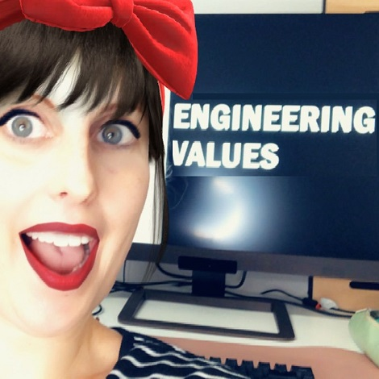

Learn how crystal clear engineering values can help you and your team to build a strong engineering culture.
   We also talk about:
<ul>
<li> We deep dive into why well-defined, explicit engineering values are a competitive advantage for your engineer teams.</li>
<li> help everyone to make decisions that are aligned with your company goals and values;</li>
<li> how they help newcomers understand what your team expects from them;</li>
<li> and how they help potential candidates to evaluate whether they would strive in your engineering team.</li>
<li> But knowing your engineering core values form also the basis for being able to answer the hard questions every engineering team should ask themselves, like:</li>
<li> what does high-quality code mean to us,</li>
<li> how much testing do we need,</li>
<li> or when is a code change ready for release?</li>

</ul>

<b>Episode Resources:</b> 
If you enjoy the podcast, <a href="https://podcasts.apple.com/at/podcast/software-engineering-unlocked/id1477527378">please rate it here</a> 
<a href="https://github.com/mgreiler/awesome-engineering-values">Curated list of core values from different companies</a> 
<a href="https://www.michaelagreiler.com/wp-content/uploads/2019/02/Code-Reviews-Do-Not-Find-Bugs.-How-the-Current-Code-Review-Best-Practice-Slows-Us-Down.pdf">Code Reviews do not find bugs – Paper</a> 
<a href="https://www.figma.com/blog/figmas-engineering-values/">Figma’s engineering principles</a> 
<a href="https://www.lullabot.com/engineering-values">Lullabot’s engineering values</a> 

<b>About Michaela Greiler</b> 
Dr. Michaela Greiler makes code reviews a team's superpower through her code review workshops. She has worked with teams from Microsoft, National Instruments, Metro Systems, Flutter, Wix and many more.

Book your <a href="https://www.michaelagreiler.com/workshops">awesomecodereview.com</a> workshop!

 

## Read the whole episode "How to build a strong engineering culture through engineering values" (Transcript)

_\[If you want, you can help make the transcript better, and improve the podcast’s accessibility via_ [Github](https://github.com/mgreiler/se-unlocked/tree/master/Transcripts)_[.](https://github.com/mgreiler/se-unlocked/tree/master/Transcripts) I’m happy to lend a hand to help you get started with pull requests, and open source work.\]_

 