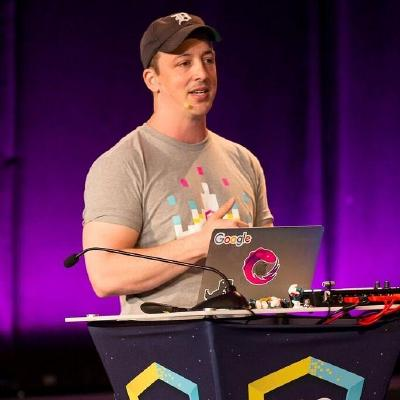

Ben Lesh, a Senior Software engineer at Citadel Securities explains how he got into Google and Netflix without a CS degree.
   We also talk about:
<ul>
<li> how he got into several FAANG companies without a CS degree,</li>
<li> the importance of building relationships, and an online brand,</li>
<li> the benefits of being helpful and kind to others,</li>
<li> the differences in engineering practices at Google, Netflix, and Citadel Securities, and</li>
<li> what RX.js is and why you might need it.</li>
</ul>

<b>Episode Resources:</b> 
Follow Michaela’s Journey on <a href="https://www.youtube.com/channel/UCWVxDd-f0EbQ_t56MyLobqw">YouTube</a> 
and on <a href="https://www.twitch.tv/doctormckayla">Twitch</a> 
<a href="https://twitter.com/BenLesh">Ben’s Twitter</a> 
<a href="https://rxjs-dev.firebaseapp.com/">Rx.js Website</a> 

<b>About Ben Lesh</b> 
Ben Lesh, is a Senior Software engineer at Citadel Securities. He got into Google and Netflix without a CS degree. Ben is also the Project Lead for RxJS. RxJS is a library for composing asynchronous and event-based programs by using observable sequences.

Book your <a href="https://www.michaelagreiler.com/workshops">awesomecodereview.com</a> workshop!

 

## Read the whole episode "How I got into FAANG companies without a CS degree" (Transcript)

_\[If you want, you can help make the transcript better, and improve the podcast’s accessibility via_ [Github](https://github.com/mgreiler/se-unlocked/tree/master/Transcripts)_[.](https://github.com/mgreiler/se-unlocked/tree/master/Transcripts) I’m happy to lend a hand to help you get started with pull requests, and open source work.\]_
