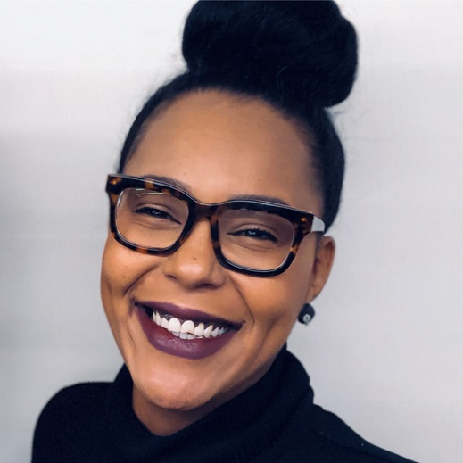

Natalie Davis, a recent Bootcamp graduate, shares how she managed to get hired right after graduating from a Bootcamp. 
   We also talk about:
<ul>
<li> her experience at a developer Bootcamp,</li>
<li> how she managed to quickly get hired after graduating,</li>
<li> how she keeps up with all the stuff she has to learn,</li>
<li> how she decides to adopt best practices,</li>
<li> and how to overcome rejections by staying positive and focusing on growth.</li>
</ul>

<b>Episode Resources:</b> 
<a href="https://twitter.com/codeFreedomRitr">Natalie’s Twitter</a> 
<a href="https://twitter.com/cjtantay">Her awesome team lead @cjtantay</a> 
<a href="https://twitter.com/marktechson">Mark: @marktechson</a> 
<a href="https://www.awesomecodereviews.com">Michaela’s code review workshops</a> 

 

<b>About Natalie Davis</b> 
Natalie Davis is a recent Bootcamp graduate, who managed to get a job right after finishing her Bootcamp. She is vividly sharing her knowledge on Twitter and started to make real waves in the dev community within just one and a half years in tech.

Today’s episode is sponsored by <a href="https://configcat.com/" target="_blank" rel="noreferrer">ConfigCat</a> – your favorite feature flag management tool to release more frequently with less risks!

## Read the whole episode "Getting a full-time dev role straight out of Bootcamp" (Transcript)

_\[Improve this transcript on [Github](https://github.com/mgreiler/se-unlocked/tree/master/Transcripts)_[.](https://github.com/mgreiler/se-unlocked/tree/master/Transcripts)\]
