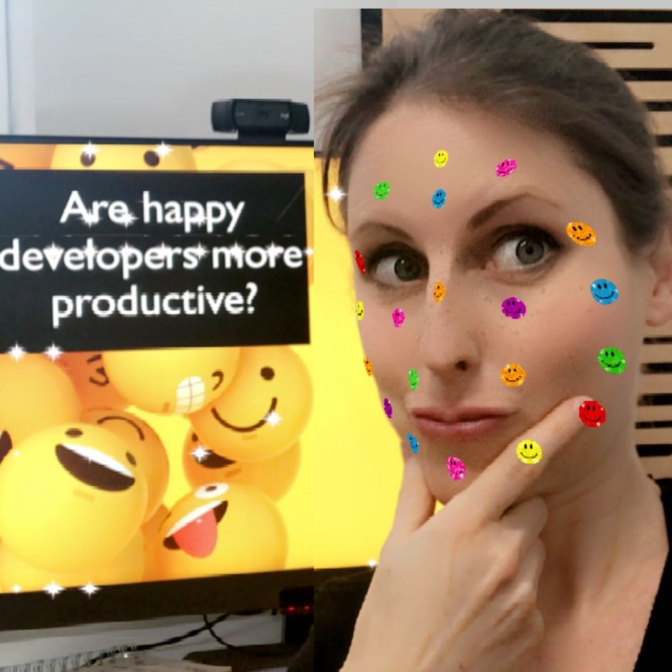

Let’s look at some research studies together to see whether “happy developers are more productive”. I will let you know my take on it, and how it relates to the study I did on developer experience.
   We also talk about:
<ul>
<li> whether happy developers are more productive</li>
<li> what makes developers happier at work</li>
<li> with which negative consequences do you have to reckon if developers are unhappy</li>
<li> and the what are the most important factors that make developers more satisfied at work.</li>
</ul>

<b>Episode Resources:</b> 
<a href="https://link.springer.com/book/10.1007/978-1-4842-4221-6">Book: Rethinking Software Engineering Productivity</a> 
<a href="https://static-content.springer.com/pdf/chp%3A10.1007%2F978-1-4842-4221-6_10.pdf?token=1643796186367--8191afc7a3341a52ba88e4c16fab5e97ad3fbd53414108bb18b2ddd04d0b31fa13a327a6bc1de3dcab4b2679dc2f87a3c554aeb4dbf4bf6a06c554b3f66606ed">Happiness and the productivity of software engineers</a> 
<a href="https://www.microsoft.com/en-us/research/uploads/prod/2019/12/storey-tse-2019.pdf?ranMID=46140&ranEAID=je6NUbpObpQ&ranSiteID=je6NUbpObpQ-bLnP8QdMEO_aR2uI2bTo4A&epi=je6NUbpObpQ-bLnP8QdMEO_aR2uI2bTo4A&irgwc=1&OCID=AID2200057_aff_7806_1243925&tduid=%28ir__3ui6r0zeeokf6ib3n3gpf6nefv2xt0zzpzm6bybd00%29%287806%29%281243925%29%28je6NUbpObpQ-bLnP8QdMEO_aR2uI2bTo4A%29%28%29&irclickid=_3ui6r0zeeokf6ib3n3gpf6nefv2xt0zzpzm6bybd00">Towards a theory of software developer job satisfaction and perceived productivity</a> 
<a href="https://www.michaelagreiler.com/wp-content/uploads/2021/12/Framework-for-Understanding-and-Improving.pdf">An actionable framework for understanding and improving Developer Experience</a> 

<b>About Michaela Greiler</b> 
Dr. Michaela Greiler makes code reviews a team's superpower through her code review workshops. She has worked with teams from Microsoft, National Instruments, Metro Systems, Flutter, Wix and many more.

Today’s episode is sponsored by <a href="https://www.codiga.io/?utm_source=podcast&utm_medium=social&utm_campaign=se_unlocked"><u>Codiga</u></a> a smart coding assistant and automated code review platform.

 

  <h2>Other episodes you'll enjoy</h2>

      

          

            <a href="https://www.software-engineering-unlocked.com/engineering-metrics/"><h4 class="mb-0">Can Engineering metrics be ethical?</h3></a>
  <audio controls preload="none">
               <source src="https://cdn.simplecast.com/audio/aaca909a-e34f-49ae-a86f-f59e4fa807f0/episodes/14f69a24-bf6f-4e84-8dd8-f57c3f73c32b/audio/3bc44755-6fc4-41cd-84bd-bc6e2228c0aa/default_tc.mp3" />
              </audio>
          

        

      

    

      

          

                       <a href="https://software-engineering-unlocked.com/measure-developer-productivity-space/"><h4 class="mb-0">Measure developer productivity using the SPACE framework</h3></a>
  <audio controls preload="none">
                <source src="https://cdn.simplecast.com/audio/aaca909a-e34f-49ae-a86f-f59e4fa807f0/episodes/5f2f49ae-1df9-4c13-9a52-670548e10892/audio/f557f044-ac96-40a4-b6b4-f8f215a1a81b/default_tc.mp3" />
              </audio>
          

        

      

          

      

          

                       <a href="https://software-engineering-unlocked.com/developer-experience-job/"> <h4 class="mb-0">High-performing engineering teams through DX</h3></a>
  <audio controls preload="none">
                <source src="https://cdn.simplecast.com/audio/aaca909a-e34f-49ae-a86f-f59e4fa807f0/episodes/08be65aa-4b4e-41f5-8d94-3611ef987d90/audio/98662bb1-c656-4b89-afbc-ab4ce94e697f/default_tc.mp3" />
              </audio>
          

        

      

 

## Read the whole episode "Are happy developers more productive?" (Transcript)

_\[If you want, you can help make the transcript better, and improve the podcast’s accessibility via_ [Github](https://github.com/mgreiler/se-unlocked/tree/master/Transcripts)_[.](https://github.com/mgreiler/se-unlocked/tree/master/Transcripts) I’m happy to lend a hand to help you get started with pull requests, and open source work.\]_
