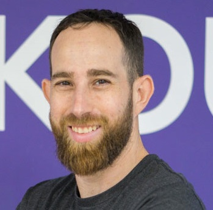

Liran Haimovitch, CTO of Rookout – an effortless debugging tool, and I talk about how to get to high-quality code.
   We also talk about:
<ul>
<li> what are the challenges of moving fast</li>
<li> what does productivity mean</li>
<li> a lot about code reviews</li>
<li> and I also give you a glimpse of the research I’m currently doing.</li>
</ul>

<b>Episode Resources:</b> 
<a href="https://www.youtube.com/watch?v=BcXtSEmNg90">This talk on YouTube</a> 
<a href="https://www.rookout.com/">Rookout</a> 
<a href="https://www.michaelagreiler.com/workshops/">My awesome code review workshops</a> 
<a href="https://queue.acm.org/detail.cfm?id=3454124">SPACE framework</a> 

<b>About Liran Haimovitch</b> 
Liran Haimovitch, CTO of Rookout – an effortless debugging tool, and I talk about how to get to high-quality code.

Book your <a href="https://www.michaelagreiler.com/workshops">awesomecodereview.com</a> workshop!

 

## Read the whole episode "The Secret To High-Quality Code with Dr. Michaela Greiler and Liran Haimovitch" (Transcript)

_\[If you want, you can help make the transcript better, and improve the podcast’s accessibility via_ [Github](https://github.com/mgreiler/se-unlocked/tree/master/Transcripts)_[.](https://github.com/mgreiler/se-unlocked/tree/master/Transcripts) I’m happy to lend a hand to help you get started with pull requests, and open source work.\]_
