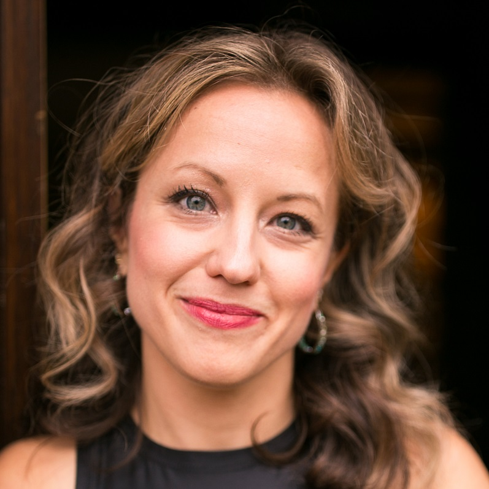

In this episode, I talk to Bekah Weigel, who runs the virtual coffee community about community building.
   We also talk about:
<ul>
<li> how she kick-started the developer community virtual coffee</li>
<li> what it takes to run the community</li>
<li> how sponsorships make it possible to be sustainable, and</li>
<li> how community members take over a large part of running the community.</li>
</ul>

<b>Episode Resources:</b> 
<a href="https://twitter.com/bekahHW">Bekah’s Twitter</a> 
<a href="https://www.twitch.tv/bekahhw/">Bekah on Twitch</a> 
<a href="https://virtualcoffee.io/">Virtual Coffee</a> 
<a href="https://twitter.com/DeepgramDevs">Deepgram Devs’ Twitter</a> 

<b>About Bekah Weigel</b> 
Bekah graduated from a Bootcamp in 2019 and quickly created a striving and very special developer community in just under two years.

Today’s episode is sponsored by <a href="https://www.codiga.io/?utm_source=podcast&utm_medium=social&utm_campaign=se_unlocked"><u>Codiga</u></a>, a smart coding assistant and automated code review platform. <a href="https://www.codiga.io/?utm_source=podcast&utm_medium=social&utm_campaign=se_unlocked"><u>Try Codiga for FREE</u></a>

 

## Read the whole episode "Running a developer community" (Transcript)

_\[If you want, you can help make the transcript better, and improve the podcast’s accessibility via_ [Github](https://github.com/mgreiler/se-unlocked/tree/master/Transcripts)_[.](https://github.com/mgreiler/se-unlocked/tree/master/Transcripts) I’m happy to lend a hand to help you get started with pull requests, and open source work.\]_

