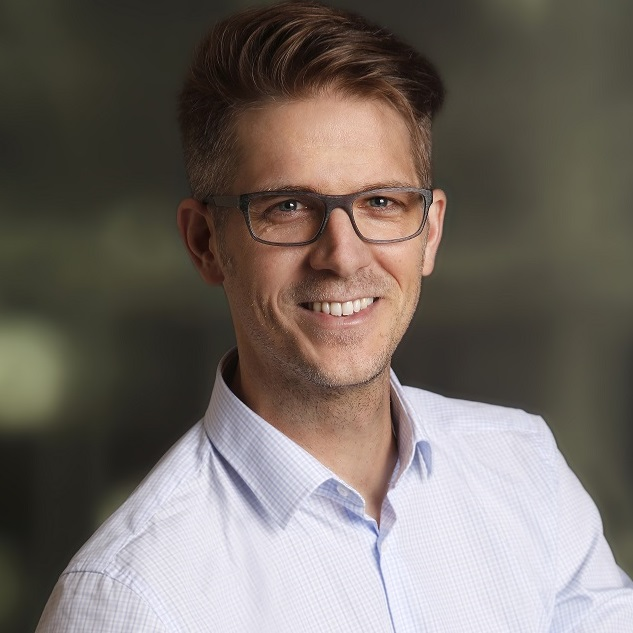

In this episode, I talk to Martin Gratzer, CEO, and founder of Topmind. Topmind is a successful boutique dev shop in the heart of Carinthia in Austria. Martin shares with me, how he managed to build a striving development agency far way from Silicon Valey and other tech hot spots.

**We talk about:**

- why he decided to start his own company,
- what helped him get started on his entrepreneurial journey,
- how he managed to be successful by focusing on a niche,
- what he advises others that want to freelance or build up the dev shop,
- and behind the scenes info on what it means to develop software as an agency.

### Subscribe on [iTunes](https://podcasts.apple.com/at/podcast/software-engineering-unlocked/id1477527378?l=en), [Spotify](https://open.spotify.com/show/2wz1OneBIDXpbBYeuyIsJL?si=2I0R0HuaTLK6RT0f7lDIFg), [Google](https://www.google.com/podcasts?feed=aHR0cHM6Ly9mZWVkcy5zaW1wbGVjYXN0LmNvbS9LMV9tdjBDSg%3D%3D), [Deezer](https://www.deezer.com/show/465682), or via [RSS](https://www.software-engineering-unlocked.com/subscribe/).

**Links:**

- [Michaela’s Code Review Workshops](https://www.michaelagreiler.com/workshops/)
- [Martin’s Twitter](https://twitter.com/mgratzer)
- [Martin’s company Topmind](https://topmind.eu/)
- [Open Tech Table](http://opentechtable.com)

**Show notes:**

Martin and I studied at the same University. And already back then, his main goal was to start his own company. So, with sweet ~25, or something like that he started Topmind – which, BTW, I have been part of at the beginning.

Since then, many years have passed, and Martin took what was once a one-man-show (after I left), and developed it into a dev shop with 5 full-time engineers and several freelancers.

Martin explains to me, how over the course of ~15 years, he built a successful company by following his curiosity, passion, and by following a strict niche-down strategy.

It was really great to connect again with Martin, and he shared tons of helpful advice for others that also want to build their own company. And all of that in a region that’s far from being Silicon Valley!

I hope you enjoy this interview as much as I did.

Best,

McKayla
